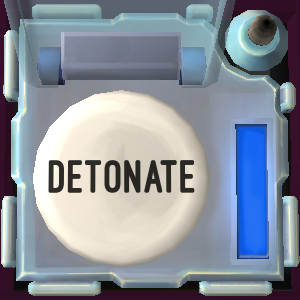

# On the Subject of the Button

Say `defuse button` to select a Button module.

Firsy, the bot will ask you for the colour and label of the button. She will then ask any necessary [edgework](https://ktane.timwi.de/More/FAQs.html#edgework) questions; answer these with `yes`, `no` or a number. She will then state what to do with the button.

If you must hold down the button, tell her the colour light that appears. She will state when to release the button.

If there are multiple Button modules, you can then describe the next one.

## Example conversation

>**Defuser**: Defuse button\
>**Bot**: Tell me the colour and label of the button.\
>**Defuser**: White Detonate\
>**Bot**: Look on the sides of the bomb. Is there a lit indicator that says CAR?\
>**Defuser**: Yes\
>**Bot**: Press and hold the button. Keep holding it, and tell me what colour light appears.\
>**Defuser**: Blue\
>**Bot**: When any digit on the timer is a 4, release the button.
