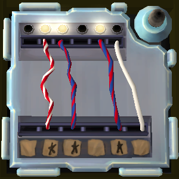

# On the Subject of Complicated Wires

Say `defuse complicated wires` to select a complicated wires module.

Describe the wires from left to right, using the following key words: `red`, `blue`, `light`, `star` or `nothing`. Say `then` or `next` between each wire. The bot will then ask any necessary [edgework](https://ktane.timwi.de/More/FAQs.html#edgework) questions; answer these with `yes`, `no` or a number. She will then state which wires to cut.

If there are multiple complicated wires modules, you can then list the wires on the next one.

# Example conversation

>**Defuser**: Defuse complicated wires\
>**Bot**: For each wire, left to right, say these key words if they apply: Red, Blue, Light, Star. Say 'next' after each wire.\
>**Defuser**: Red light star, then red blue light star, then red blue light star, then nothing\
>**Bot**: How many batteries are there on the sides of the bomb?\
>**Defuser**: 3\
>**Bot**: Cut the following wires: the first wire, the fourth wire.
