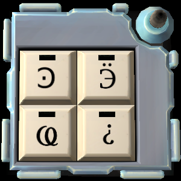

# On the Subject of Keypads

Say `defuse keypad` to select a Keypad module.

Describe each glyph on the keypad in separate messages. The bot will let you know whether she recognised each description. After you describe all four glyphs, she will tell you in what order to press them.

Say `new keypad` to start working on a new module.

## Example conversation

>**Defuser**: Defuse keypad\
>**Bot**: Describe one of the glyphs on the keypad.\
>**Defuser**: A backward C with a dot\
>**Bot**: OK. Describe the second glyph.\
>**Defuser**: A backward E with dots\
>**Bot**: OK. Describe the third glyph.\
>**Defuser**: A loop the loop\
>**Bot**: OK. Describe the last glyph.\
>**Defuser**: An upside-down question mark\
>**Bot**: Press the backward E. Then say OK.\
>**Defuser**: OK\
>**Bot**: Press the backward C. Then say OK.\
>**Defuser**: OK\
>**Bot**: Press the cursive loop. Then say OK.\
>**Defuser**: OK\
>**Bot**: Press the upside-down question mark. Then say OK.

## Glyph reference

Currently recognised descriptions for the keypad glyphs are listed below. Many of the glyphs originate from Greek, Cyrillic and Arabic alphabets. The original names of those characters are listed in italic, and the names from http://www.bombmanual.com/ are in bold. For more information on the origins of the glyphs, see [Ezekiel and Timwi's listing](https://ktane.timwi.de/HTML/Keypad%20symbol%20names%20(Ezekiel%20%26%20Timwi).html).

|Glyph|Descriptions|
|:---:|---|
|  | _**copyright** sign_; circled C |
|  | ***filled star***; black star; full star |
|  | ***hollow star***; white star; clear star; empty star |
|  | *teh with ring*; **smiley face**; smiley; face |
|  | *zhe*; **double K**; butterfly; back-to-back Ks; X and I; ink blot |
|  | ***omega***; O with feet |
|  | *iotified big yus*; **squid with knife**; spaceship; kitty; cat; dog; spearman |
|  | *omega with titlo*; **pumpkin**; game controller; butt; boobs; W |
|  | *kai*; **hooked N**; honda; curvy H; H |
|  | *gangia*; **tipi**; tent; underlined X |
|  | *be*; **six**; flat six |
|  | *archaic koppa*; **squiggly N**; lightning |
|  | *little yus*; **A T**; pyramid; A with tail; illuminati symbol |
|  | ***ae*** |
|  | *komi dzje*; **melted three**; half three; melted R; half R |
|  | *E*; **Euro**; backward E; dotted E; |
|  | *hundred thousands*; **circle**; hills |
|  | *short I with tail*; **N with hat**; backward N; upside-down N |
|  | *ksi*; **dragon**; alien; snake |
|  | *upside-down **question mark*** |
|  | *pilcrow sign*; **paragraph** mark; blind P; backward P |
|  | *lunate sigma*; **right C**; forward C |
|  | *inverted lunate sigma*; **left C**; backward C |
|  | *psi*; **pitchfork**; menorah; trident; candelabrum; Jewish candelabrum |
|  | *big yus*; **tripod**; squid |
|  | *abkhasian ha*; **cursive**; wisp; curly fry; loop the loop; spring |
|  | *thousands*; **tracks**; not equal sign; hash; squares; jigsaw piece; puzzle piece; tracks |
|  | *koppa*; **balloon**; mirror; paddle; racquet; O with tail |
|  | *zeta*; **weird nose**; nose; seven |
|  | *lambda*; **upside-down Y**; crossed Y; curly T; _Half-Life_ logo |
|  | *yat*; **B T**; upside-down P; P T; tampa bay logo |
