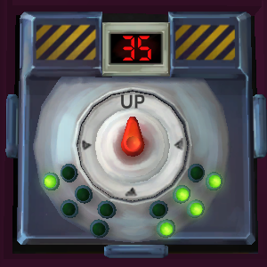

# On the Subject of Knobs

Say `defuse knob` to select a Knob module.

List the states of the six lights on the left side of the module, as `on` or `off`. `All off` is also recognised. The bot will tell you which direction to turn the knob to. This is with respect to the 'Up' label; for instance, if the bot says 'up', you must turn the knob to wherever the 'Up' label actually is.

## Example conversation

>**Defuser**: Defuse knob\
>**Bot**: Read the lights on the left side of the module: 'on' or 'off' in reading order.\
>**Defuser**: Off off off on off off\
>**Bot**: Turn the knob to the left position, with respect to the 'Up' label.
