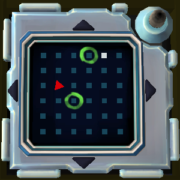

# On the Subject of Mazes

Say `defuse maze` to select a Maze module.

You must locate one of the green circles, the white dot and the red triangle, in that order. Coordinates are recognised as a column number followed by a row number, with (1, 1) being the top left corner.

Once you have stated where the red triangle is, the bot will respond with the sequence of steps you must take.

Say `new maze` to start working on a new module.

## Example conversation

>**Defuser**: Defuse maze\
>**Bot**: Locate a green circle.\
>**Defuser**: 3 4\
>**Bot**: Locate the white dot.\
>**Defuser**: 5 1\
>**Bot**: Locate the red triangle.\
>**Defuser**: 2 3\
>**Bot**: Take these steps: East, South 3 times, West, North, West 3 times.
