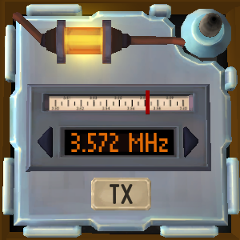

# On the Subject of Morse Code

Say `defuse Morse code` to select a Morse code module.

Read out part of the sequence of dashes, dots and spaces. You may start at any letter, but if you start at the start of the word, be sure to let the bot know by stating `start`. If this is enough to determine the word, the bot will reply with the frequency you must tune the module to.

In the vanilla game, the first three letters is always enough to determine the word.

Use the following key words: `dash`, `long`, `dot`, `short`, `space`, `start`. `Start` may immediately follow a `space`. Make sure your input does not end in the middle of a letter.

## Example conversation

>**Defuser**: Defuse Morse code\
>**Bot**: Tell me part of the sequence of dashes, dots, spaces and the start of the word. Three letters after the start is enough.\
>**Defuser**: start dash dot dot dot space dot dash dot space dot\
>**Bot**: The word is 'break'. Tune the module to 3.572 MHz, then press TX.
