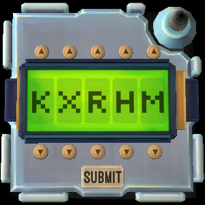

# On the Subject of Passwords

Say `defuse password` to select a Password module.

Start by listing the six possible letters for the first slot in the password using the NATO phonetic alphabet. After each stage, the bot will either tell you the password or ask for the next set of letters.

Say `new password` to start working on a new module.

## Example conversation

>**Defuser**: Defuser password\
>**Bot**: Tell me the six possible letters for the first position.\
>**Defuser**: kilo tango alfa november echo x-ray\
>**Bot**: Tell me the six possible letters for the second position.\
>**Defuser**: x-ray foxtrot india sierra papa romeo\
>**Bot**: The password is 'after'.
